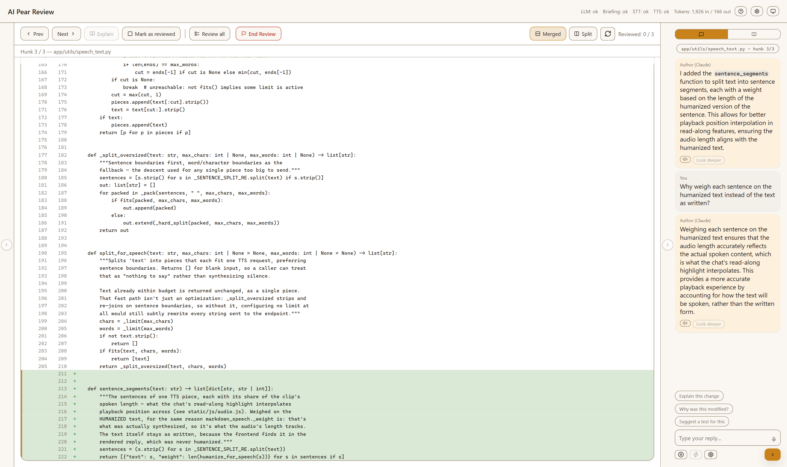

# AI Pear Review

[](https://github.com/PearsReview/ai-pear-review/actions/workflows/ci.yml)

> **Beta (0.0.x).** It works, but expect rough edges, and settings or
> file formats may change between releases — see
> [Known issues](#known-issues-and-limitations).

A local web app that walks you through your own uncommitted git changes
one hunk at a time, with an AI persona narrating each change, answering
questions about it, and (optionally) applying small edits you agree on —
all running against your own working tree, in your own browser.

It's for the review you do *before* you commit: your own changes, or a
batch a coding agent just made for you and you want to understand line by
line rather than accept on trust.

> A **hunk** is one contiguous block of changed lines in `git diff`. A
> file with three separate edits has three hunks; each one is a step of
> the review.



<sub>Narrated by a local `qwen2.5-coder:7b` through Ollama. There's a [dark theme](docs/img/review-ui-dark.png) too.</sub>

```
cd ~/your-project && python ~/ai-pear-review/run.py
```

## What it does

Run it inside a git repo with uncommitted changes and it opens a review in
your browser, one hunk per step:

- The whole file is shown as a diff (Merged or Split), with the current
  hunk highlighted.
- Click **Explain** and an AI persona explains what the hunk does and why
  (or set it to explain every hunk as you reach it); you reply by typing or
  by voice — ask questions, discuss alternatives, request a change.
- Mark lines as context for your question, or leave inline review comments
  (GitHub-PR style) that are bundled into one hand-off document at the end.
- **Act Now** applies a small change you've agreed on, after you confirm a
  preview.
- **Look deeper** hands a question the narrator can't answer to a coding
  agent, which investigates the repo read-only.
- **All files** mode lets you open and ask about any file in the repo, not
  just the changed ones.
- Review progress and queued comments are saved, so a refresh or restart
  doesn't lose them.

## Recommended setups

Each part runs locally or on a hosted service. Only narration is required;
anything missing disables its own feature and nothing else.

| Part | Everything local (a capable GPU) | Hosted models (company API access) |
|---|---|---|
| Narration + chat | Ollama (the default) | `provider: anthropic` + `ANTHROPIC_API_KEY` |
| Act Now + Look deeper | Cline, set up with your local model | Cline, set up with Anthropic |
| Voice in and out | [stt_tts](https://github.com/PearsReview/stt_tts) (CPU is enough) | Your company's STT/TTS endpoint |
| Prep skills | Cline on the local model, or Claude Code | Claude Code or Cline |

Mix freely — e.g. local narration with a hosted model behind Cline. Local
models are noticeably weaker at Act Now and Look deeper than at narrating.

**On cost:** the app never runs the `claude` CLI, so it never spends a
Claude Code subscription. `provider: anthropic` is the per-token API. Act
Now and Look deeper use whatever model and credentials you gave Cline.

## Requirements

- Python 3.10+ and `git` on PATH
- A repo with at least one commit and some uncommitted changes
- A model for narration: a local [Ollama](https://ollama.com) server (the
  default), or an `ANTHROPIC_API_KEY`
- Optional: [Cline](https://docs.cline.bot) (needs Node.js), an STT/TTS
  endpoint (e.g. [stt_tts](https://github.com/PearsReview/stt_tts)), and
  [Claude Code](https://claude.com/claude-code) or Cline for
  the prep skills

## Install

Steps 1–4 get you a running review; 5 and 6 add optional features.

**1. Get the code.**

```
git clone https://github.com/PearsReview/ai-pear-review.git
cd ai-pear-review
pip install -r requirements.txt
```

A virtualenv is recommended: `python -m venv .venv`, then
`.venv\Scripts\activate` (Windows) or `source .venv/bin/activate`.

**2. Install and start [Ollama](https://ollama.com).** It must be
*running*, not just installed — the desktop app starts it, as does
`ollama serve`.

**3. Pull the model** named in `app/config.yaml` (about 5 GB):

```
ollama pull qwen2.5-coder:7b-instruct-q4_K_M
```

> **Using Anthropic's API instead?** Skip steps 2 and 3 and make **both**
> changes — the key alone changes nothing:
>
> 1. Set `conversation.provider: anthropic` in `app/config.yaml` (or pick
>    it in the app's settings panel).
> 2. Put `ANTHROPIC_API_KEY=sk-ant-...` in a `.env` file at the app's root
>    (see `.env.example`), or set it in your shell.

**4. Run it against your repo** — see [Run it](#run-it). The app's working
files (`.review/`, `.briefing/`, `.context/`) are kept out of your
`git status` automatically.

**5. (Optional) Set up Cline** for Act Now and Look deeper:

```
npm i -g cline
cline auth
```

`cline auth` is where you choose Cline's provider and model. Then pick
Cline under **Model settings → Coding agent** in the app. Don't run Cline
with auto-approve.

**6. (Optional) Voice.** For an all-local setup, run
[stt_tts](https://github.com/PearsReview/stt_tts), a small speech service
(faster-whisper + Kokoro, CPU-only) that serves exactly what the app's
defaults expect at `http://localhost:8000`, so there's nothing to
configure. To use another speech-to-text / text-to-speech service instead,
point the `stt`/`tts` endpoints in `app/config.yaml` at it; any service
matching [the expected request/response shape](docs/configuration.md)
works. Set a bearer token in the settings panel, never in the file.

### If something's wrong, it says so

Startup checks your setup and prints what it found:

```
AI Pear Review — checking your setup

  [OK  ] git: found at /usr/bin/git
  [OK  ] repository: /home/you/your-project
  [OK  ] changes: 4 file(s) with uncommitted changes
  [WARN] model: qwen2.5-coder:7b-instruct-q4_K_M is not installed
         -> Run: ollama pull qwen2.5-coder:7b-instruct-q4_K_M
```

`FAIL` stops startup (no git, or not a git repo). `WARN` starts anyway, and
says what to fix.

## Prep skills (optional, recommended)

The narrating model sees one hunk and nothing else, so when it doesn't know
something it tends to guess. Three skills, run in your own Claude Code or
Cline session *before* opening the app, give it real context. The app only
reads what they leave behind.

| Skill | Answers | Rerun when |
|---|---|---|
| **project-overview** | What is this project, and what is this file for? | the architecture changes |
| **call-map** | Who calls the code in this hunk? (Python only) | HEAD moves |
| **prep-review** | Why was *this hunk* written this way? | the diff changes |

Install them into the repo you're reviewing, once per repo:

```
python /path/to/ai-pear-review/install_skills.py --repo ~/your-project
```

Then, in Claude Code or Cline opened in that repo, run `/project-overview`,
`/call-map` and `/prep-review` in that order — or just ask "prep the
review". Run prep-review at the end of the session that made the changes,
while it still knows *why* each change was made.

More in [docs/prep-skills.md](docs/prep-skills.md): the opt-in
`--with-reminders` hook and Cline rule, and running the skills against a
repo without installing them.

## Run it

```
cd ~/your-project && python ~/ai-pear-review/run.py
python run.py --repo ~/your-project        # the same, from the app's folder
```

It opens `http://127.0.0.1:8765` in your browser, or the next free port if
that one is taken. Every setting lives in the commented `app/config.yaml`;
[docs/configuration.md](docs/configuration.md) walks through it.

**First time with a new repo?** The app runs without any of this, but the
narration is much better with it:

1. Install the prep skills there, once:
   `python ~/ai-pear-review/install_skills.py --repo ~/your-project`
   (add `--with-reminders` for a nudge to brief your changes before a
   session ends).
2. Commit the installed `.claude/` files or add them to `.gitignore`.
   Otherwise they show up in the review as new files.
3. In Claude Code or Cline opened in that repo, run `/project-overview`,
   `/call-map` and `/prep-review` ([Prep skills](#prep-skills-optional-recommended)).
4. Start the app as above.

Later reviews in the same repo only need step 3's `/prep-review` (and
`/call-map` once HEAD has moved). The settings panel shows how old the
overview and call map are.

## Using the review UI

- **Start Review / End Review** — narration and chat begin only once you
  click Start Review; browsing the diff always works.
- **Prev / Next** — move between hunks.
- **Explain** (next to Next) — asks the AI to explain the change you're on.
  By default nothing is explained until you click it, so you choose which
  changes are worth a model call; you can also just ask a question without
  one. To have every change explained as you move to it, set **Explain
  changes** to *Automatically* in the chat's settings (the gear under the
  message box).
- **Mark as reviewed / Review all** — track progress; shown per file in the
  file explorer.
- **File explorer** (left) — jump to any changed file. The folder icon
  switches to **All files**, to open and ask about any file.
- **Merged / Split** — how the diff is drawn. **Refresh** re-reads the
  diff after you've changed files outside the app.
- **Chat** (right) — type, or push-to-talk with the mic. **Overall** shows
  every turn; **File** just this file's.
- **Line marking** — double-click a line to mark it as context for your
  next message; **+** on a line adds an inline review comment.
- **Create plan** (top toolbar, once comments are queued) — turns every
  queued comment into a plan for your coding agent, saved as
  `.review/review_<time>.md`. Optionally it's also saved as an agent skill,
  so in Claude Code or Cline you just run `/apply-review` (or ask it to
  apply the review); the dialog remembers your choice. The plan opens in the
  preview pane, with **Copy instruction** and **Copy plan** buttons, and
  **View review plan** (also on the end-of-review summary) reopens it. Each
  comment keeps the lines it's about and flags any whose code has changed
  since. **End Review** with comments still queued offers to create the
  plan first.
- **Act Now** — toggle on, describe a small change, and confirm the
  preview before anything is written. Needs Cline ([step 5](#install)).
- **Look deeper** — under each answer; the coding agent investigates the
  question read-only. Slower than a normal reply.
- **?** in the header replays the guided tour.

## Known issues and limitations

- **Uncommitted changes only.** It reviews the working tree against `HEAD`
  — the repo needs at least one commit, and branch or PR review isn't
  supported yet.
- **No model, no narration.** If Ollama isn't running or the API key is
  missing, the diff is still browsable but nothing narrates. The **LLM**
  pill in the header shows this.
- **Slow model calls are dropped, not waited for**, so on slow hardware a
  hunk can simply never narrate — see
  [Performance and hardware](docs/configuration.md#performance-and-hardware).
- **Chat history doesn't survive a restart**; review progress and queued
  comments do.
- **Any language can be reviewed; few can be navigated.** The call map only
  scans Python.
- **Step Into is hidden for now.** It only recognises Python and
  JavaScript. Remove `class="hidden"` from `#step-into-btn` in
  `static/index.html` to turn it back on.
- **One coding agent.** Act Now and Look deeper run through Cline only, and
  are only as good as the model you give it. Look deeper was tested mainly
  with Claude Sonnet 5; small local models give shallower answers.
- **Prep skills need Claude Code or Cline** — other assistants don't read
  `.claude/skills/`.
- **Lightly tested.** Only a few machines and models have been tried.

## TODO

- **Review beyond the working tree** — a branch against its base, past
  commits, and pull requests (posting the review back).
- **Comments and Act Now on unchanged files** — All files mode can ask
  about a file, but not comment on it or edit it.
- **Keep the conversation** across restarts, and let it be exported.
- **More languages** for Step Into and the call map (e.g. via tree-sitter),
  then bring the Step Into button back.
- **More coding agents** — Act Now and Look deeper use the open Agent
  Client Protocol (ACP), so other ACP agents can be added alongside Cline.
- **Skills for other assistants** — Cursor rules, Copilot instructions,
  `AGENTS.md`.
- **Install as a command** — `pipx install`, with a user-level config file
  instead of editing `app/config.yaml`.

## How it works

Narration and chat are one model call per turn to Ollama or the Anthropic
API, with no tools. Act Now and Look deeper are handed to Cline over the
[Agent Client Protocol](https://agentclientprotocol.com), always in a
temporary copy of your repo: Look deeper can't write at all, and an Act
Now edit reaches your files only after you confirm it.
[docs/architecture.md](docs/architecture.md) has the full picture.

## Further reading

- [docs/configuration.md](docs/configuration.md) — every setting, and performance tuning
- [docs/architecture.md](docs/architecture.md) — the components, degraded mode, and startup step by step
- [docs/prep-skills.md](docs/prep-skills.md) — the prep skills in full
- [docs/wire-protocol.md](docs/wire-protocol.md) — the browser/server message contract
- [CONTRIBUTING.md](CONTRIBUTING.md) — tests, project layout, house style

## Privacy

The app reads the repo it's pointed at and sends parts of it to whichever
model you configured: Ollama stays on your machine; the Anthropic API, or
Cline set up with a hosted provider, sends code to that provider. A remote
STT/TTS service receives your recorded audio and anything read aloud. Make
sure that's acceptable for the code you review — the all-local setup keeps
everything on your machine.

## Licence

MIT — see [LICENSE](LICENSE).
