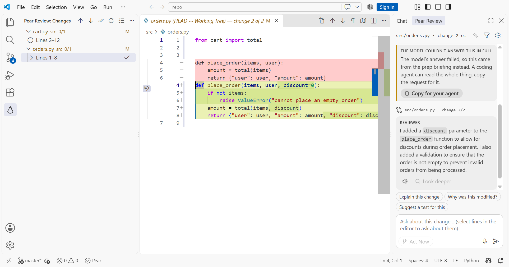

# AI Pear Review for VS Code

> **Early development (0.0.x).** The review loop works end to end: the
> Changes tree, the native diff, the chat with voice, Look deeper, inline
> comments, Create Plan and Act Now, plus questions about any file and
> markdown read aloud. Expect rough edges, and settings may change between
> releases.

A VS Code front end for [AI Pear Review](https://github.com/PearsReview/ai-pear-review).
It walks you through your uncommitted git changes one hunk at a time, with an AI
reviewer you can talk to. The Python backend is the same one the web app uses,
lives in this repo's root (`app/`, `static/`, `run.py`); the extension is this
`vscode/` folder, and the `.vsix` carries a copy of the backend. The web app is
unaffected and still works on its own.



## Requirements

- VS Code 1.106 or later, with a **local**, trusted workspace. Remote, WSL and
  Codespaces windows aren't supported: the mic and the speaker are on your
  machine, and the extension has to run beside them.
- Python 3.10 or later. Run **Pear Review: Set Up Python Environment** once: it
  makes a private environment with the backend's packages and `sounddevice` (for
  the mic and for reading aloud). Or point `pearReview.pythonPath` at an
  interpreter that already has them.
- The model and speech services the backend is configured for (by default,
  Ollama, plus a local STT/TTS service on port 8000). See the backend's
  [README](https://github.com/PearsReview/ai-pear-review#readme).
- **For pull request reviews only:** GitHub's
  [GitHub Pull Requests](https://marketplace.visualstudio.com/items?itemName=GitHub.vscode-pull-request-github)
  extension (`GitHub.vscode-pull-request-github`), signed in to GitHub. It checks
  the PR out and handles its comments and the submitted review; Pear Review
  follows it. It's optional, not a declared dependency: reviewing your own
  changes doesn't need it, so it isn't installed with Pear Review. **Review Pull
  Request…** offers to install it the first time.

## Installing

The extension isn't on the Marketplace, so build it from this repo and install
the `.vsix`. You need [Node.js](https://nodejs.org) 20 or later.

1. Build the `.vsix`:

   ```
   git clone https://github.com/PearsReview/ai-pear-review.git
   cd ai-pear-review/vscode
   npm install
   npm run package
   ```

   This writes `ai-pear-review-<version>.vsix` into the `vscode/` folder, with a
   copy of the backend inside it.

2. Install it into VS Code, either from the command line:

   ```
   code --install-extension ai-pear-review-<version>.vsix
   ```

   or from VS Code itself: open the Extensions view
   (**Ctrl+Shift+X**, **Cmd+Shift+X** on macOS), click the **⋯** menu at the top
   of it, and choose **Install from VSIX…**.

3. Reload VS Code when it offers to, then run **Pear Review: Set Up Python
   Environment** (see [Requirements](#requirements) above) before your first
   review.

**Platform notes for step 3:**

- **macOS**: if your `python3` is Apple's system build (3.9), the command
  automatically tries versioned names (`python3.12`, `python3.11`, …), so a
  Homebrew or pyenv install is found without extra configuration.
- **Linux**: many distributions ship `python3` without the venv module. If
  setup fails, install it first:
  ```
  sudo apt install python3-venv python3-dev   # Debian/Ubuntu
  sudo dnf install python3-devel              # Fedora/RHEL
  ```
  `sounddevice` also needs PortAudio at runtime for the mic and read-aloud:
  ```
  sudo apt install libportaudio2              # Debian/Ubuntu
  sudo dnf install portaudio                 # Fedora/RHEL
  ```
- **Windows**: `py -3` (the Python Launcher) is tried automatically, so a
  standard python.org install works with no extra steps.

To work on the extension itself instead, see [Developing](#developing) below.

## Your code and your data

The extension runs a backend on your machine and sends parts of the repository
you're reviewing to the model you choose. Ollama (the default) stays on your
machine. The Anthropic API, or a coding agent (Cline) set up with a hosted
provider, sends that code to the provider. A remote speech service receives your
recorded audio and anything read aloud. Act Now can write to your working tree,
only after you confirm a preview. Reviewing a pull request signs in to GitHub
(VS Code's own GitHub sign-in) to read the PR's base; your comments go to GitHub
through the GitHub Pull Requests extension, not through Pear Review. Nothing is sent anywhere until you start a
review, and the extension itself collects no telemetry. Details:
[Privacy](https://github.com/PearsReview/ai-pear-review#privacy) and
[Security](https://github.com/PearsReview/ai-pear-review/blob/main/SECURITY.md).

## Using it

**Pear Review: Get Started** (also in the chat's ⚙) walks through the steps
below.

1. Open a git repository that has uncommitted changes. With several
   repositories in the window, **Switch Repository** on the Changes view picks
   the one to review; each keeps its own backend and its own review, and
   switching back resumes it where it was.
2. Open the **Pear Review** view from the activity bar. It opens your changes
   straight away: browse the diffs and ask about them in the chat, which opens
   as a **Pear Review** tab in the secondary side bar, beside other chat
   extensions such as Claude Code. Press **Start Review** to mark changes
   reviewed, leave comments and get a summary at the end.
3. The **Changes** tree lists every changed file and its hunks. The current
   hunk opens as a diff (HEAD ↔ working file) with its lines highlighted.
   Click any hunk to jump to it; use the ↑/↓ buttons on the tree for
   Prev/Next, and ✓ on the current hunk to mark it reviewed.
4. Press ✨ in the **Chat** view to have the reviewer explain the change on
   screen, or choose **Explain changes: Automatically** in ⚙. Ask by typing
   (suggested questions sit above the message box), or press
   **Ctrl+Alt+Space** (**Cmd+Alt+Space** on macOS) to start speaking and again
   to send.
5. To ask about particular lines, select them in the diff (either side)
   before you ask. The chat shows "Asking about calc.py, lines 2–4"; the
   selection goes with that one question.
6. **Look deeper** under a reply has your coding agent (Cline) read the
   repository for a more thorough, read-only answer. 🔊 reads a reply aloud,
   and **Interrupt** stops whatever the reviewer is doing.
7. To leave a comment for your coding agent, hover the diff's gutter and press
   **+** (drag over several lines first to comment on all of them), then type
   what should change and press **Must fix**, **Suggestion** or **Nit**. Or
   press the **mic** in the comment box's title bar, say it, and press it again:
   your words become the comment. Comments can be edited, re-tagged or deleted
   until you create the plan.
8. **Act Now**: press **Act Now** next to the message box, then type or say
   what to change (selected lines go with it). Your coding agent works in a
   copy of the repo and proposes the change; each file opens as a diff.
   **Apply** writes it, **Refine** asks for changes to the proposal, and
   **Discard** drops it. Nothing touches your files until you apply.
9. **Ask Pear About This File** (right-click a file in the Explorer, or in
   the editor) points the chat at any file in the repo, changed or not, even
   before a review starts. Ask by text or voice, with selected lines as
   context. **Back to review**, or moving to another change, returns the
   chat to the review.
10. **Read Aloud** on a markdown file: the speaker on its row in the Changes
    view, in its editor's or preview's title bar, or on right-click in the
    Explorer. While it reads, the same place shows pause, play and stop, and
    the passage being read is highlighted. Select lines in the file first to
    read only those. It needs a text-to-speech service that returns WAV.
11. **Create Plan** (the checklist button on the Changes view) writes all
    comments to `.review/review_<time>.md`, optionally as an `/apply-review`
    skill too, and gives you the line to hand your coding agent.
12. When every change is marked reviewed (one at a time, or all at once with
    ✓✓ on the Changes view), or you choose **End Review**, the review ends: a
    notification sums it up (how much was reviewed, the comments waiting, and
    buttons to create the plan, open the last plan, reopen the review or start
    a new one), and the Changes view and the chat's header say it has ended.
    Reviewed marks, comments and Act Now are locked from then on, but you can
    still open any change and ask about it. **Reopen Review** (↻ on the
    Changes view) picks the same review back up, marks and comments included.

### Reviewing a GitHub pull request

Pull requests are reviewed with GitHub's own **GitHub Pull Requests**
extension, and Pear Review adds its walkthrough, explanations and chat on top.

1. **Review Pull Request…** (in the Changes view's **…** menu, or the command
   palette) opens GitHub's Pull Requests view, or offers to install the
   extension if it's missing.
2. Check the PR out there. **Checkout in Worktree** leaves your own checkout and
   uncommitted changes alone; a plain **Checkout** switches your branch.
3. Pear Review follows the checked-out PR: the Changes view lists the PR's
   changes against the point where it branched, as GitHub's **Files changed**
   shows them. Explanations, questions about selected lines, voice and Look
   deeper work as in a local review. **Explain This Change** (✨ in an editor's
   title bar) explains the change the cursor is in, in Pear's diff or in
   GitHub's.
4. Comment, reply, suggest changes, mark files Viewed and submit the review
   (Comment, Request changes or Approve) with GitHub's extension: those go to
   the PR. Pear's own comments, reviewed marks, Act Now and plans are off for a
   pull request.

After checking out a different PR, Pear Review notices when the window regains
focus, or run **Refresh Pull Request**. Remotes on github.com work as they are;
for GitHub Enterprise (Server, or Enterprise Cloud on `ghe.com`), set VS Code's
own `github-enterprise.uri` setting to your server's address.

The chat holds the conversation. Act Now proposals, the review's end, notices
and errors appear as VS Code notifications. The status bar's **Pear** item
names any service that's down; hover it for the model, speech, coding agent and
token use.

**Settings**: the ⚙ in the chat is the one place for settings. It opens the same
settings as the web app's panel:

- **Preferences**: explain changes automatically or only when you ask, speak
  replies aloud, and voice input on or off. Kept by the extension.
- **Reviewer model**: provider and model, context size, reply length and
  timeout, and the API key. The provider can be a local Ollama model, the
  Anthropic API, or any OpenAI-compatible endpoint or gateway (set its base
  URL and key under **Reviewer model**).
- **Speech**: the text-to-speech and speech-to-text service endpoints and
  tokens.
- **Coding agent**: Cline, or none. Act Now and Look deeper need one. The agent
  uses the model you set up in Cline itself (`cline auth`), which may be a paid
  API.
- **Review context**: whether the prep files (project overview, call map,
  change briefings) are present and up to date, and how to refresh them.

Model, speech and agent settings are saved per repository, in the same place
the web app keeps them.

To use the Anthropic API instead of a local model, set the key under
**Reviewer model** in settings (⚙), then choose Anthropic as the model. For
an OpenAI-compatible endpoint, choose OpenAI-compatible, set its base URL,
and set the key the same way. The key is kept in VS Code's secret storage
and passed to the backend when it starts; setting it offers to restart the
backend so it takes effect.

## Developing

```
git clone https://github.com/PearsReview/ai-pear-review.git
cd ai-pear-review/vscode
npm install
python -m venv .venv
# Windows:
.venv/Scripts/python -m pip install -r ../requirements.txt "sounddevice>=0.4,<1.0"
# macOS / Linux:
.venv/bin/python -m pip install -r ../requirements.txt "sounddevice>=0.4,<1.0"
```

`npm run package` (and `npm run test:package`) copy the repo's backend into
`backend/` first; that folder is generated and gitignored, and once it exists the
extension prefers it over the repo root, so delete it to run against your edits.

Press **F5** to launch an Extension Development Host. The extension uses the
`pearReview.pythonPath` setting if it's set, then the environment **Set Up
Python Environment** made, then this repo's `.venv`.

```
npm run lint && npm run typecheck && npm test
npm run package
```

The backend is this repo's root (`app/`, `static/`, `run.py`), so a change it
needs goes in the same pull request. It must pass the root checks (`pytest tests/`,
`ruff`, `mypy`) and leave the web app working (docs/STYLE.md §7).

### Tests

| Command                           | What runs                                                                                                                                                                      | Time    |
| --------------------------------- | ------------------------------------------------------------------------------------------------------------------------------------------------------------------------------ | ------- |
| `npm test`                        | Unit tests of the pure helpers, and DOM tests of the chat panel's script under jsdom                                                                                           | seconds |
| `python -m pytest test/python`    | The audio player's WAV decoding                                                                                                                                                | seconds |
| `npm run test:package`            | The `.vsix` holds what the backend needs to start                                                                                                                              | seconds |
| `npm run test:integration`        | A real VS Code with the extension and a real backend, in four workspaces: a scratch repo, two repos in one window, a folder that isn't a repository, and a GitHub pull request | ~1 min  |
| `npm run test:integration:ollama` | The scratch-repo workspace only, with your local Ollama as the reviewer model                                                                                                  | minutes |

In the integration suite everything the backend calls out to is a fake
(`test/integration/`): a local server stands in for Ollama, the speech
service and GitHub's API and records every request, the backend's scripted agent
(`tests/fake_acp_agent.py`) stands in for Cline, and a fake `sounddevice`
records a tone instead of opening the microphone. The backend runs from a
temporary copy with a patched config, so the repo's backend is never edited. Only the
model switches to the real one with `:ollama`.

Tests drive the extension through its commands and the chat's message handler,
and read UI state through a test probe the extension exposes only when
`PEAR_REVIEW_TEST=1` (`src/testProbe.ts`).

How the code is laid out, and the rules it follows, are in
[docs/STYLE.md](https://github.com/PearsReview/ai-pear-review/blob/main/vscode/docs/STYLE.md).

## Credits

The chat panel's icons are VS Code's [codicons](https://github.com/microsoft/vscode-codicons),
licensed under [CC BY 4.0](https://creativecommons.org/licenses/by/4.0/).
